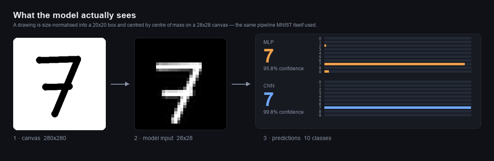

# Handwritten Digit Classifier

Draw a digit in the browser and watch two neural networks argue about what you wrote —
a small multilayer perceptron and a convolutional network, scored side by side, with
their full probability distributions on screen.

**[▶ Try the live demo](https://mnist-digit-classifier-723611762821.us-central1.run.app)**



It is a complete inference service, not a notebook: models are exported to ONNX,
served by a FastAPI app in a container, and loaded from object storage at startup.
Cold start is under a second.

---

## What makes it work

**Preprocessing is where the accuracy actually lives.** MNIST digits are not raw
crops — the dataset size-normalises each digit into a 20×20 box preserving aspect
ratio, then centres it on a 28×28 canvas by **centre of mass**, not by the centre of
its bounding box. A model trained on that distribution and fed a naively downscaled
drawing will underperform badly. The service replicates the original pipeline exactly,
and the UI shows you the 28×28 array the network really receives, so the transformation
is never a black box.

**Model artifacts are decoupled from the container.** The image ships code only. The
ONNX graphs live in object storage and are pulled into a local cache at startup, which
means shipping a retrained model is an upload, not a rebuild and redeploy. It works
against anything S3-compatible — AWS S3, Cloudflare R2, MinIO, GCS — or a plain HTTPS
URL.

**Inference runs on ONNX Runtime, not PyTorch.** Torch is a build-time dependency used
to train and export; it never enters the serving image. For two models totalling under
300 KB of weights, shipping a 1 GB deep learning framework to run them is the wrong
trade:

| | With PyTorch | With ONNX Runtime |
|---|---|---|
| Image size | 1117 MB | **346 MB** |
| Framework import | 1.68 s | **0.18 s** |
| Container start → serving | 10–20 s | **0.8 s** |

The exported graphs are verified against their PyTorch checkpoints across all 10,000
test images — **zero differing predictions** — before they are considered shippable.

## Results

Accuracy on the full 10,000-image MNIST test set:

| Model | Architecture | Test accuracy |
|---|---|---|
| CNN | Reduced LeNet — 2 conv layers (6 and 16 maps, 3×3) + 2×2 max pooling → 400-120-84-10 | **97.11%** |
| MLP | 784 → 15 → 10, fully connected | **91.62%** |

The MLP is deliberately tiny — 15 hidden units — which makes the comparison
interesting: it is the control that shows what convolution actually buys you on image
data, at a fraction of the parameters.

## Architecture

```
   Browser                        Container                        Object storage
  ┌────────────────────┐        ┌──────────────────────────┐      ┌────────────────┐
  │ canvas 280×280     │  POST  │ FastAPI                  │  GET │ mlp.onnx       │
  │ → PNG data URL     ├───────►│  normalise → 28×28       ├─────►│ cnn.onnx       │
  │ ← digit + 10 probs │        │  ONNX Runtime × 2 models │ once └────────────────┘
  └────────────────────┘        └──────────────────────────┘  at start
```

| File | Role |
|---|---|
| `server.py` | FastAPI service — `/predict`, `/health`, serves the UI |
| `inference.py` | ONNX Runtime sessions, numpy softmax |
| `preprocess.py` | Drawing → 28×28 MNIST-format array |
| `weights.py` | Pulls artifacts from object storage, local fallback |
| `static/index.html` | Canvas UI — vanilla JS, no build step |
| `models.py` | PyTorch architectures (training and export only) |
| `train_mlp.py` / `export_onnx.py` | Train, then export to ONNX with parity checks |
| `publish_hf.py` / `deploy_cloudrun.sh` | Publish artifacts, deploy the service |
| `security.py` | Request size, image size and rate limits |
| `evaluate.py` | Test-set accuracy, per-class report, ONNX-vs-PyTorch verification |
| `tests/` | pytest suite — preprocessing properties, scoring, HTTP contract, limits |

## Quick start

```bash
python -m venv .venv && .venv/bin/pip install -r requirements.txt
.venv/bin/python -m uvicorn server:app --reload --port 8008
```

Open http://127.0.0.1:8008. With no `WEIGHTS_URI` set it reads the `.onnx` files from
the repo directory.

Containerised, with MinIO standing in for production object storage:

```bash
docker compose up --build      # http://localhost:8080
```

To retrain and re-export (needs the training dependencies):

```bash
.venv/bin/pip install -r requirements-train.txt
.venv/bin/python train_mlp.py
.venv/bin/python export_onnx.py
.venv/bin/python evaluate.py --onnx --synthetic
```

## API

```bash
# JSON, base64-encoded image
curl -X POST http://localhost:8008/predict \
  -H 'Content-Type: application/json' \
  -d "{\"image\": \"$(base64 -i drawing.png)\"}"

# multipart upload
curl -X POST http://localhost:8008/predict/upload -F file=@drawing.png

# liveness, runtime and artifact source
curl http://localhost:8008/health
```

Response:

```json
{
  "empty": false,
  "runtime": "onnxruntime 1.28.0",
  "MLP": { "pred": 7, "probs": [0.001, ...], "no_signal": false },
  "CNN": { "pred": 7, "probs": [0.000, ...], "no_signal": false },
  "preview": "data:image/png;base64,..."
}
```

`preview` is the 28×28 array the models received — useful for debugging a
misclassification, since it usually turns out the drawing, not the model, was the
surprise.

## Hardening

The endpoint is public and unauthenticated, and decoding a user-supplied image
is the entire attack surface. Three controls, each written against a hole that
was reproduced first:

- **Decompression bombs.** A 137 KB PNG can decode to 144 megapixels — enough to
  exhaust a 512 MiB instance. Dimensions are read from the image header and
  rejected *before* any pixel buffer is allocated.
- **Oversized bodies.** Starlette buffers the whole request before a handler
  runs, so a 100 MB payload costs 100 MB of memory even when the handler rejects
  it. `Content-Length` is checked in middleware and refused above 2 MB.
- **Request flooding.** A fixed-window per-client limit, backed by a hard
  instance cap and a request timeout at the platform level.

Every PIL failure path returns a `400` rather than escaping as a `500`. The
limits and their bypasses are covered in `tests/test_api.py`, and the full threat
model, including accepted risks, is in [DEPLOY.md](DEPLOY.md#threat-model).

## Tests

```bash
pip install -r requirements-dev.txt
pytest
```

58 tests, under a second, no torch and no dataset download — the suite runs
against the same ONNX artifacts the service serves. CI additionally asserts that
importing `server` never pulls torch into `sys.modules`, which is the regression
that would silently undo the image-size and cold-start work.

## Deployment

See [DEPLOY.md](DEPLOY.md). The artifacts are published to a Hugging Face model repo
(free, plain HTTPS, no bucket credentials) and the container runs on Cloud Run, which
scales to zero. Any S3-compatible store and any container host work equally well.

## Licence

MIT.
